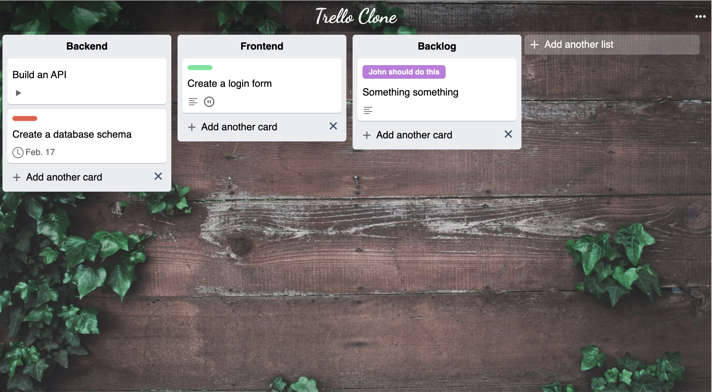

# Trello clone 

Trello clone web application made with Mongo, Express, React, NodeJS.   
(Mern stack)



## Live Demo

Checkout the live demo at:   
[https://trello-clone.vukotic.io/][demo]

## Repositories
Frontend: [https://github.com/nkzd/trello-clone-frontend][frontend-repo]   
Backend: [https://github.com/nkzd/trello-clone-backend][backend-repo]

## Storybook

Project was built with component driven design in mind using storybook, run storybook with:

```sh
yarn start storybook
```

## Development setup

##### Backend:  
  
Clone the repo:
``` git clone https://github.com/nkzd/trello-clone-backend.git```

Install the dependencies: 
```npm install ```

Run the backend app (default port is 1337): 
```npm run start```

##### Frontend:

Clone the repo:
``` git clone https://github.com/nkzd/trello-clone-frontend```

Install the dependencies: 
```yarn install ```

Create a .env file with REACT_APP_API_URL enviroment variable that points to backend. Example can be found in .env.example file. Default is http://localhost:1337/.
``` REACT_APP_API_URL="http://localhost:1337/"```

Run the frontend app (default port is 3000): 
```yarn start```

## License

Distributed under the MIT license. See ``LICENSE`` for more information.

[https://github.com/nkzd][github]

<!-- Markdown link & img dfn's -->

[wiki]: https://github.com/yourname/yourproject/wiki
[demo]: https://trello-clone.vukotic.io/
[backend-repo]: https://github.com/nkzd/trello-clone-backend
[frontend-repo]: https://github.com/nkzd/trello-clone-frontend
[linkedin]: https://www.linkedin.com/in/aljosa-vukotic/
[github]: https://github.com/nkzd